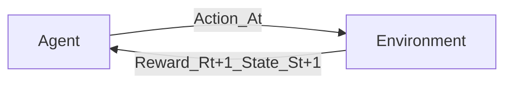

# Reinforcement Learning: Definition and Main Elements (PYQ 6a - 2024, PYQ 8a(ii) - May 2023, PYQ 4a - 2022, PYQ 6a - CBGS)

## 1. What is Reinforcement Learning (RL)?

**Reinforcement Learning (RL)** is a type of machine learning where an **agent** learns to make a sequence of decisions by interacting with an **environment** to achieve a specific **goal**. Unlike supervised learning (where the agent learns from labeled data) or unsupervised learning (where the agent finds patterns in unlabeled data), RL agents learn from the consequences of their actions through a system of **rewards** and **punishments**.

**The Core Idea: Learning by Doing and Experiencing**

The agent explores the environment, takes actions, and receives feedback in the form of rewards (positive values for desired outcomes) or penalties (negative values for undesired outcomes). The primary objective of the agent is to learn a **policy**—a strategy for choosing actions—that maximizes its cumulative reward over time.

**Think of it as:** Training a dog. You don't give the dog a textbook on how to sit. Instead, when the dog performs an action (like sitting when you say "sit"), you give it a treat (a reward). If it does something undesirable, it might get a verbal correction (a mild punishment or lack of reward). Over time, the dog learns which actions lead to treats.

## 2. Main Elements of Reinforcement Learning

Several key components define an RL problem and its solution:

### a) Agent
*   **Definition:** The learner or decision-maker. It's the entity that interacts with the environment, observes its state, and chooses actions.
*   **Role:** To learn an optimal policy for selecting actions to maximize cumulative reward.
*   **Examples:** A program controlling a robot, an algorithm playing a game, a system managing traffic lights.

### b) Environment
*   **Definition:** The external world or system with which the agent interacts. It encompasses everything outside the agent.
*   **Role:** It receives actions from the agent, transitions to new states based on those actions (and its internal dynamics), and provides rewards to the agent.
*   **Examples:** The physical world for a robot, the rules and board of a game for a game-playing AI, a simulated stock market for a trading bot.

### c) State (`s` or `S_t`)
*   **Definition:** A complete description of the environment at a particular point in time, relevant for the agent to make a decision. It captures all necessary information from the history.
*   **Role:** The agent observes the state to decide which action to take next.
*   **Examples:** The position of all pieces on a chessboard, the sensor readings of a robot (e.g., position, velocity, camera input), the current price levels in a stock market.
*   The set of all possible states is called the **state space (S)**.

### d) Action (`a` or `A_t`)
*   **Definition:** A choice made by the agent that influences the environment.
*   **Role:** Agents select actions based on their policy and the current state.
*   **Examples:** Moving a piece in chess, applying a certain torque to a robot's motor, buying or selling a stock.
*   The set of all possible actions, often dependent on the state `s`, is called the **action space (A or A(s))**.

### e) Reward (`r` or `R_t`)
*   **Definition:** A scalar feedback signal from the environment to the agent. It indicates the immediate desirability of the agent's action taken in a particular state or resulting in a particular transition.
*   **Role:** Rewards are the primary basis for learning. The agent's goal is to maximize the total reward it receives in the long run.
    *   Positive rewards reinforce behaviors that led to them.
    *   Negative rewards (penalties or punishments) discourage behaviors.
*   **Examples:** +1 for winning a game, -1 for losing; +10 for reaching a destination, -0.1 for each step taken (to encourage efficiency); profit or loss from a trade.

### f) Policy (`π`)
*   **Definition:** The agent's strategy or decision-making rule. It maps states to actions.
*   **Role:** It dictates how the agent behaves given a certain state.
*   **Types:**
    *   **Deterministic Policy (`π(s) = a`):** In state `s`, the agent always takes action `a`.
    *   **Stochastic Policy (`π(a|s) = P(A_t=a | S_t=s)`):** In state `s`, the agent chooses action `a` with a certain probability.
*   **Goal of RL:** To find an optimal policy `π*` that maximizes the cumulative expected reward.

### g) Value Function (`V(s)` or `Q(s,a)`)
*   **Definition:** A prediction of the expected future cumulative reward. It quantifies how good it is for the agent to be in a particular state, or to take a particular action in a particular state.
*   **Role:** Value functions are used to evaluate policies and to guide the search for better policies.
    *   **State-Value Function (`V^π(s)`):** Expected return starting from state `s` and then following policy `π`.
    *   **Action-Value Function (`Q^π(s,a)`):** Expected return starting from state `s`, taking action `a`, and thereafter following policy `π`.
*   The optimal value functions (`V*(s)` and `Q*(s,a)`) specify the maximum possible return from each state or state-action pair.

### h) Model of the Environment (Optional)
*   **Definition:** The agent's representation of how the environment behaves. Specifically, it predicts:
    1.  **State Transitions:** Given a state and action, what is the probability of reaching the next state? (`P(s'|s,a)`)
    2.  **Reward Dynamics:** Given a state and action (and possibly next state), what is the expected immediate reward? (`R(s,a)` or `R(s,a,s')`)
*   **Role:** If an agent has a model, it can plan by thinking ahead and simulating possible future scenarios without actually experiencing them.
*   **Types of RL based on Model:**
    *   **Model-Based RL:** The agent learns or is given a model of the environment and uses it for planning (e.g., Value Iteration, Policy Iteration often assume a known model).
    *   **Model-Free RL:** The agent learns directly from experience through trial and error, without explicitly learning a model (e.g., Q-Learning, SARSA).

## 3. The RL Interaction Loop (Agent-Environment Interaction)

The process of reinforcement learning can be visualized as a continuous loop:

1.  **Observe State:** At time `t`, the agent observes the current state `S_t` of the environment.
2.  **Select Action:** Based on `S_t` and its policy `π`, the agent selects an action `A_t`.
3.  **Environment Responds:** The agent performs action `A_t`.
4.  **Receive Reward & New State:** The environment transitions to a new state `S_{t+1}` based on `S_t` and `A_t`. The environment also provides a reward `R_{t+1}` to the agent.
5.  **Learn (Update Policy/Value Function):** The agent uses the received reward `R_{t+1}` and the new state `S_{t+1}` (and possibly `S_t`, `A_t`) to update its policy `π` and/or its value function(s).
6.  **Repeat:** The loop continues until a terminal state is reached or for a predefined number of steps.

## 4. Goal of Reinforcement Learning

The ultimate goal of an RL agent is not just to get high immediate rewards, but to learn an **optimal policy (`π*`)** that maximizes the **cumulative expected reward** over the long run. This cumulative reward is often called the **return (`G_t`)** and is typically a discounted sum of future rewards:

`G_t = R_{t+1} + γR_{t+2} + γ^2R_{t+3} + ... = Σ_{k=0}^{∞} γ^k R_{t+k+1}`

where `γ` (gamma) is the discount factor (0 ≤ γ ≤ 1), which balances the importance of immediate versus future rewards.

## 5. Examples of Reinforcement Learning

*   **Game Playing:** AlphaGo (Go), OpenAI Five (Dota 2), AlphaStar (StarCraft II), chess engines.
*   **Robotics:** Training robots to walk, grasp objects, navigate, or perform complex assembly tasks.
*   **Autonomous Vehicles:** Learning driving policies.
*   **Recommendation Systems:** Learning to suggest products or content that a user is likely to engage with.
*   **Resource Management:** Optimizing energy consumption, managing financial portfolios, or controlling chemical reactions.
*   **Healthcare:** Personalized treatment plans, drug discovery.

## 6. Summary for Exams (PYQ 6a - 2024, PYQ 8a(ii) - May 2023, PYQ 4a - 2022, PYQ 6a - CBGS)

*   **RL Definition:** Agent learns by interacting with an environment, receiving rewards/penalties, to maximize cumulative reward.
*   **Main Elements:**
    *   **Agent:** Learner/decision-maker.
    *   **Environment:** External system agent interacts with.
    *   **State (`s`):** Current situation.
    *   **Action (`a`):** Agent's choice.
    *   **Reward (`r`):** Immediate feedback signal.
    *   **Policy (`π`):** Agent's strategy (state -> action map).
    *   **Value Function (`V` or `Q`):** Predicts future rewards.
    *   **(Optional) Model:** Agent's understanding of environment dynamics.
*   **Interaction Loop:** Agent observes state, takes action, gets reward & new state, learns, repeats.
*   **Goal:** Learn an optimal policy (`π*`) to maximize expected cumulative (discounted) reward.

Understanding these core components is crucial for grasping how various RL algorithms work. 